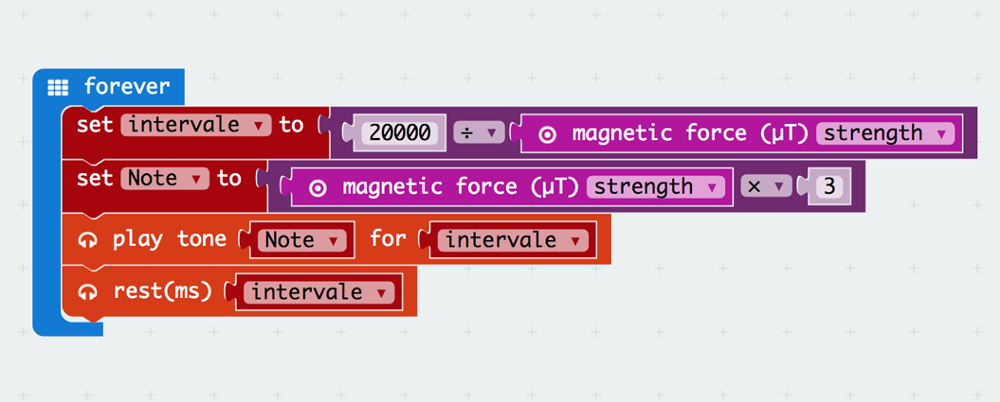
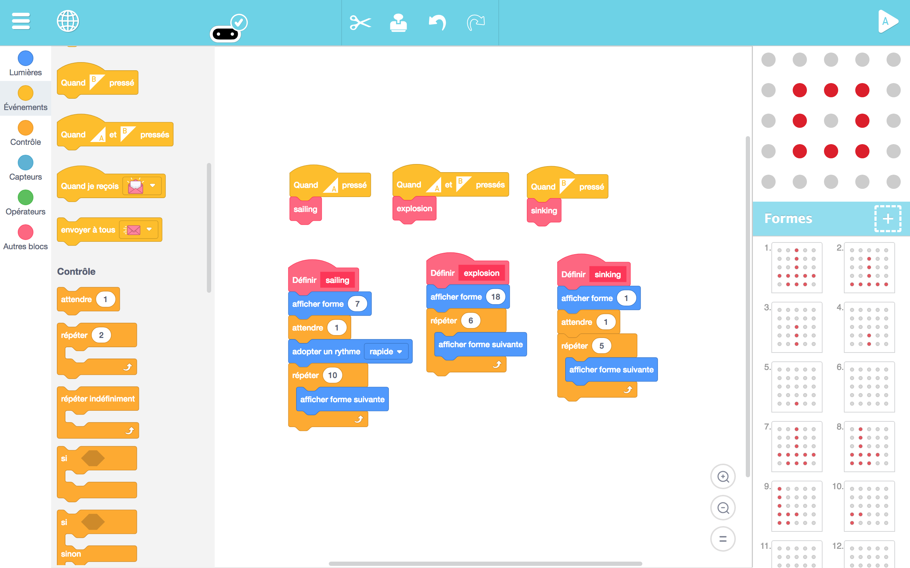

# DAY 2: Create the perfect pirate lair

Pirates need a place to relax and live a genuinly unproductive life.

## 1. Introductory unplugged activity 

### Build your pirate lair (inspired by RTP Architect) 
> INDOORS and OUTDOORS

The space will be divided in two (or three) areas, each with a theme, for example:
1. The relaxation area
2. The working space
3. The place to keep the treasure

In the center there is pile of objects to distribute in the different thematic areas. (we will need lots of elements, cussion, chairs, strings, branches...)

| Young kids (5 to 7) | Older kids (8 to 12) |
|---------------------|----------------------|
|1. Create two teams, one for each thematic area | 1. Create two (or three) teams, one for each thematic area |
|2. Create two (or three) categories of objects and ask the group to decide what object belongs where.|2. Create two (or three) categories of objects and ask the group to decide what object belongs where.|
|3. In each team, choose the 5 most important objects to place first. |3. In each team, choose the 5 most important objects to place first.|
|4. Open discussion with kids on where to place the selected items. |4. In each team, Architects are designated to draw a plan (top vue) of where each of the selected objects should go in the area.|
|5. Now is time to place the other objects and decorate the lair with objects from nature. |5. The teams rotate, but the Architects stay where the are. Each team has to follow thee instructions of the Architects to achieve the plan. |
|     | 6. Once every team is done building there part of the lair, now is time to place the other objects and decorate the lair with objects from nature.|
|6. Finaly, the kids design a pirate flag, and hang it to their lair|7. Finaly, the kids design a pirate flag, and hang it to their lair|

```diff
Feed back of tests with KCJ team (19-06-2018): 
+ Positive feedback of the activity
+ Take into acount extra time needed
```

## 2. Makecode coding session - Older kids (age 8 to 12)

Prepare the MicroBit for fishing by creating a magnetic detector. See the Take Code Out section for details of the activity.

```diff
+ TODAY WE LEARN:
1. What is magnetism? 
2. What is an interval in time and what is pitch in sound?
3. How are they related?
4. How a magnetic detector would work?
5. Play with a first program to detect magnetism
```

### 2.1 Blocks Code

#### 2.1 Fish detector code



### 2.2 Text Code
```javascript
let Note2 = 0
let intervale = 0
basic.forever(() => {
    intervale = 20000 / input.magneticForce(Dimension.Strength)
    Note2 = input.magneticForce(Dimension.Strength) * 3
    music.playTone(Note2, intervale)
    music.rest(intervale)
})
```

## 3. Artbit coding session - Young kids (age 5 to 8)

```diff
+ TODAY WE LEARN:
1. How to create pixel art animations
2. What is a function block
3. Play with a simple Microbit first **animation**
```

1. Create their own Fishing animation in Artbit 




## 4. Take the code out!

> INDOORS and OUTDOORS

It is time to go fishing. Members of the crew program a microbit that detects magnetic fields and emit sound.
They can use it as a special fish finder to catch their dinner more efficiently. 

Material:
* A blanket to act as the see surface
* Cardboard fishies with magnets attached to them
* Fishing poles with a magnet attached to the string 

1) One Explorer is sent on the sea (blanket) with his MicroBit to find the Fish.
2) The Fisherman is standing outside the sea (blanket) with the fishing rod.
3) Heavy items hold the blanket firmly to the ground (rocks, chairs, etc.)
4) The goal is for the Fisherman to catch the fish with the help of the explorer
5) The sound has a higher pitch and a higher repetition rate as the explorer gets closer to the fish (magnet)
6) The explorer gives precise instructions to the fisherman to catch the fish.

***TODO add photo of the fishing game***

```diff
Feed back of tests with KCJ team (19-06-2018): 
+ Positive feedback of the activity 
+ Introduce to give directions to locate fish as a follow up of the first exercice
```
## 4. Changes to the plan

The unplugged activity planned for this day was a variant of the architect game from RPT. We quickly realized that this gae takes a lot of time. Since it had rudundancies with other unplugged activities we had planned (the Maori dance on Day 1 and the treasure map on day 4), we decided to drop it because of time constrains. 

While kids were working on their code, a third instructor was hosting the fishing game activity outside. Kids were called in pairs to play the fishing game. One kid was finding the fish with the magnet detector and the second one was fishing. Then they changed roles. The camp provided us an helper instructor. We have put him in charge of the outdoor activities and it made our lives a lot easier. 

### Young kids (age 5 to 8)

Before starting the fishing activity we had the kids play with magnets and introduced them to magnetism.

### Older kids (age 8 to 12)
Even though the fish finder code looks simple (only 4 lines of code) it is difficult to grasp for a beginner. The key to understanding how this code works is to first understand how music works with the Micro:bit. Instead of trying to create this code with the kids, we first make a simple musical instrument with Makecode to change the pitch of the sound.

*** PLEASE ADD THE DEMO CODE FOR THE INTRODUCTION TO MUSIC (SIMPLE INSTRUMENT microbit-music-democode.hex in ./Makecode/Final/day2)***

## 4. Conclusions 

### Young kids (age 5 to 8)
1. **Unplugged Activities**

We decided to focus a lot more on drawing with this age group. They started drawing different sorts of fish that were later used for the fishing activity or for decorating the pirate lair.

2. **Coding**

The activity for this day was for the kids to designed a simple story with ArtBit. The example we showed them was a pirate ship being bombed and sinked. This simple secuential animation opened the eyes to the possibility of telling stories or to make simple animations. The Process with small kids was: 

- Start drawing the idea ( ex: a ship )
- Tell a story with that idea ( ship animation )
- Give them freedom to add their own personality

We noted that telling stories using the scrolling up, down, left, right options on the Artbit was not straight forward at all, even for us, the instructors. Make sure you have tested this feature and that you can explain it if you intend to show it to the kids. Additionnal options could be added to the Artbit user interface to improve this (ex.: individual timelines for each of the functions).

3. **Taking the code out**

It is important to be open to change plans fast because kids this age tend to have a really short span of attention. On average kids can stay a maximum of 45 minutes at the computer working on their story, after 30 minutes we already see kids go up and start to play. The fishing game was a great idea with in small batches. Having them play in turns gave us more control to the overall operation and contributed to increase to duration of the coding activity (roughly an hour).


### Older kids (age 8 to 12)
1. **Unplugged Activities**

We decided to drop the unplugged activity to have more time explaning music with the Microbit.

2. **Coding**

We had the opportunity to dive into the details of how do to music with the microbit. We explained them how music is based on numbers which represent the frequency of the sound, i.e. the number of vibrations per second (with base 440Hz being the reference for musicians). The first activity was to create a simple musical instrument using the buttons on the microbit to change the tone of the sound. Through this activity we also introduced variables. With the more advanced kids we have been able to introduce the magnetism sensor and have them understand how the fish detector works.

*** TODO: Insert image of the white board for music ***

Some of them started creating their own music and adding them to their stories and animations. We had a lot of fun with this acticity which really confirmed that the sound is an essential part of the microbit experience.


3. **Taking the code out**

They really enjoyed the fishing activity and now they started to understand how the microbit was programmed to detect the magnetism and produce a sound proportionnal to the signal!


Authors: B.Ferragut and D.Banville - June 2018

© 2012 - 2018 Kids Code Jeunesse | All Right Reserved

