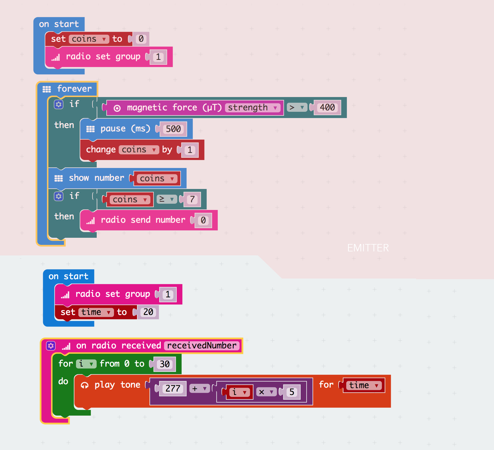

# DAY 5: The final battle

It is well known that pirates like to fight just for fun.

## 1. Introductory unplugged activity

### Build an unbreakable treasure chest

There is a lot to do to get ready for the battle. First the team has to build an unbreakable treasure chest that looks awesome and that contains the heart of their captain.

## 2. Microbit activity

> Add technological security features to your treasure chest

The treasure chest can be opened only if every team member puts in his/her coin. The chest is also equiped with an alarm system that warns the team if it has been opened. The team has to write two different microbit programs to achieve these functionnality. They will work in teams of two to achieve this goal by them selves.

```diff
+ TODAY WE LEARN:
1. How to we use buttons to increment and decrement a variable?
2. How to use conditionals
3. How to create a sound alarm
4. Use the radio to send an alarm message
```

> There are two microbits to program:
1. A coin counter for opening the chest. Press a increments the counter by one, pressing B decrements de counter by 1 and pressing A+B resets the counter. When counter is greater then 7, a message is sent by radio to the alarm.
2. A microbit that produces an alarm sound when it receives a message.

### 2.1 Blocks Code

### 2.2 Text Code
> Emitter
```javascript
let coins = 0
input.onButtonPressed(Button.A, () => {
    coins += -1
})
input.onButtonPressed(Button.AB, () => {
    coins = 0
})
input.onButtonPressed(Button.B, () => {
    coins += 1
})
coins = 0
radio.setGroup(1)
basic.forever(() => {
    if (input.magneticForce(Dimension.Strength) > 400) {
        basic.pause(500)
        coins += 1
    }
    basic.showNumber(coins)
    if (coins >= 7) {
        radio.sendNumber(0)
    }
})
```
>Reciever
```javascript
let time = 0
radio.onDataPacketReceived( ({ receivedNumber }) =>  {
    for (let i = 0; i <= 30; i++) {
        music.playTone(277 + i * 5, time)
    }
})
radio.setGroup(1)
time = 20
```

```diff
Feed back of tests with KCJ team (22-06-2018): 
- Important: Mantain separated Magnets from Microbits
- Because we used strong magnets, microbits were affected by the strong magnetic fields!
```

## 2b. Artbit - code for begginers

No Artbit activity for this day. We prepare for the Capture the Flag game by decorating our treasure chest.

## 3. Final battle: capture the heart of the captain

The final battle is in three stages:


PREPARATION:
0. Draw two large circles on the grass to delineated the safe zones
1. Give each player a fla that they attach to their waist 
2. Put a treasure chest in the middle of each save zone with a ball inside representing the heart of the captain
3. Give each player a golden coin
4. An instructor is posted at each chest to act as the keeper of the chest

OPENING THE CHEST
1. To open the chest every player has to enter the safe zone of the opposite team and give his coin to the keeper of the chest.
2. The other team can defend by pulling the attackers flag
3. Once an attacker has lost his flag, he has to go back to its base to put another one.
4. Once the coin counter is greater then 7, the alarm goes off, the keeper releases the heart of the captain for the attacker to take it.

BRING THE HEART BACK TO SAFETY
1. The attackers have to bring the heart back to their safe zone.
2. They can throw the ball to each other
3. If the attacker in possession of the ball gets his flag taken, the game ends.
4. If the ball is intercepted by the defenders, the game ends.
6. The winner of the round is the team that successfully brings the captain's heart back to their base.

Rules:

1. No more than one coin per person in their possession
2. Maximum of 1 person in the zone each time
3. Opening the chest gives 1 point
4. You need to have a flag attached to you to give your coin
5. No one can take your flag if you are in a safe zone.
6. Bringing the heart back give an extra 1 point
7. Only one chest can be opened at a time.
8. You cannot take the ball in the hands of another players

> Kids define their own strategy on how to capture the Heart of the captain

## 4. Conclusions

### Young kids (age 5 to 8)

The capture the flag game was to complex for the smaller kids. We need to design a simplified version of the game for them.

### Older kids (age 8 to 12)

We let the kids do the project by them selves without any demonstration. They had all the elements to do it by the end of the week (radio, buttons, variables, conditionals) and every team made it.

The final game is complex. It is a challenge to explain it and to make it work properly. After a first experimentation stage, the rules of the game are now more clear. It is a good game because the kids can try to make up a strategy.

Improvements to the game:

1. Different alarms for each team
2. Every kids puts their t-shirt in their pants before putting the flag
3. Make sure the microbit have enough radio range to reach the alarm


## 5. General Conclusions

Authors: B.Ferragut and D.Banville - June 2018

© 2012 - 2018 Kids Code Jeunesse | All Right Reserved
